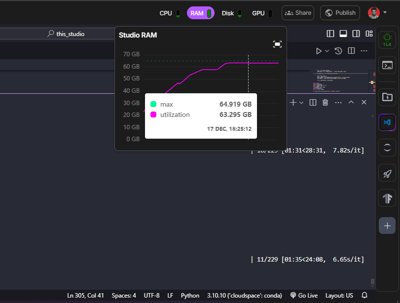
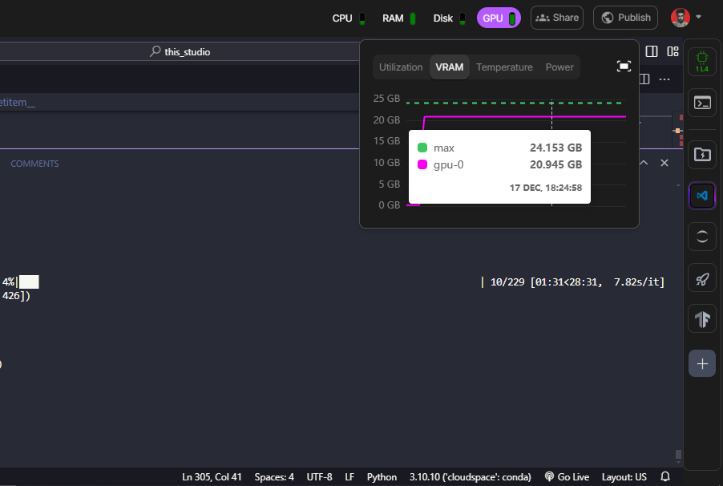

# It is a small experiment to create an efficient Video Autoencoder for graphics with little VRAM memory and possible use in the [Prometheus](https://github.com/Rivera-ai/Prometheus) model

## Memory Usage

### RAM


### VRAM


## Installation

```bash
git clone https://github.com/Rivera-ai/VideoAutoencoder.git
cd VideoAutoencoder
pip install -e .
```

## Training Results

### Epoch 0 Reconstruction Progress

The following videos demonstrate the reconstruction quality at different steps during the first epoch of training:

#### Step 0
<video width="320" height="240" controls>
  <source src="videos/step0_epoch_0.mp4" type="video/mp4">
Your browser does not support the video tag.
</video>

#### Step 50
<video width="320" height="240" controls>
  <source src="videos/step50_epoch_0.mp4" type="video/mp4">
Your browser does not support the video tag.
</video>

#### Step 100
<video width="320" height="240" controls>
  <source src="videos/step100_epoch_0.mp4" type="video/mp4">
Your browser does not support the video tag.
</video>

#### Step 150
<video width="320" height="240" controls>
  <source src="videos/step150_epoch_0.mp4" type="video/mp4">
Your browser does not support the video tag.
</video>

#### Step 200
<video width="320" height="240" controls>
  <source src="videos/step200_epoch_0.mp4" type="video/mp4">
Your browser does not support the video tag.
</video>